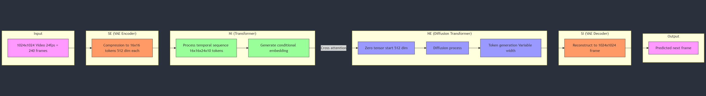
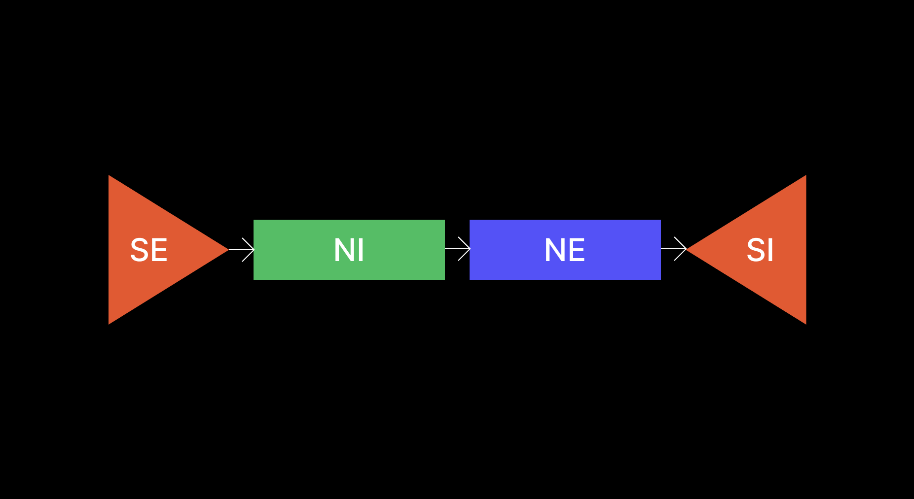

# Jung World Model

## Architecture

This project implements a World Model for video prediction, consisting of several key components:

1. **VAE Encoder (SE):**  The VAE Encoder takes a sequence of video frames (e.g., 10 seconds at 24fps) as input and compresses them into a lower-dimensional latent representation.  This compression helps to capture the essential features of the frames and discard irrelevant details. The encoder consists of convolutional layers followed by fully connected layers to produce the mean (mu) and log variance (logvar) of the latent distribution.

2. **Temporal Transformer (NI):** This transformer processes the sequence of latent vectors output by the VAE Encoder.  It captures the temporal dependencies between the frames, learning how the latent representation changes over time. The output of the temporal transformer is a sequence of context vectors, along with a final conditional embedding summarizing the entire temporal sequence.

3. **Diffusion Transformer (NE):**  The Diffusion Transformer is a novel component that predicts future frames. It takes the conditional embedding from the Temporal Transformer as input.  The Diffusion Transformer iteratively refines a latent representation of the next frame. This iterative process allows the model to generate detailed and temporally consistent predictions. The output of the Diffusion Transformer is a set of latent tokens representing the next frame's latent representation.

4. **VAE Decoder (SI):** The VAE Decoder takes the predicted latent representation (tokens) from the Diffusion Transformer and reconstructs the predicted frame in the original image space. The decoder mirrors the encoder architecture, using transposed convolutional layers followed by a sigmoid activation function to produce the final image.

## Training Process

The model is trained in three phases:

* **Phase 1: VAE Training:**  The VAE Encoder and Decoder are trained together to minimize the reconstruction loss (MSE) and the KL divergence between the learned latent distribution and a prior distribution.

* **Phase 2: Transformer Training (Frozen VAE):** The Temporal Transformer and Diffusion Transformer are trained while keeping the VAE weights frozen. The models are trained to predict the next frame in the sequence, using the reconstruction loss between the predicted frame and the actual next frame.

* **Phase 3: Full Model Fine-tuning:** Finally, all components of the World Model (VAE, Temporal Transformer, and Diffusion Transformer) are trained together to fine-tune the entire system for next-frame prediction.

This architecture allows the model to learn a compressed representation of the world, capture temporal dependencies, and generate future frames, effectively building a "world model" from video data.
